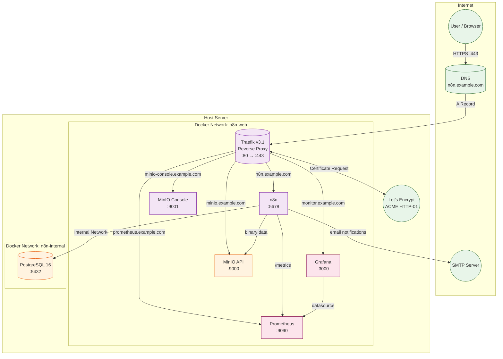
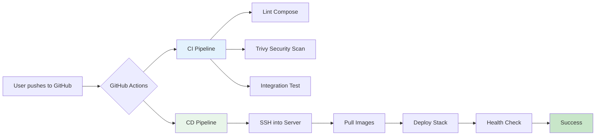
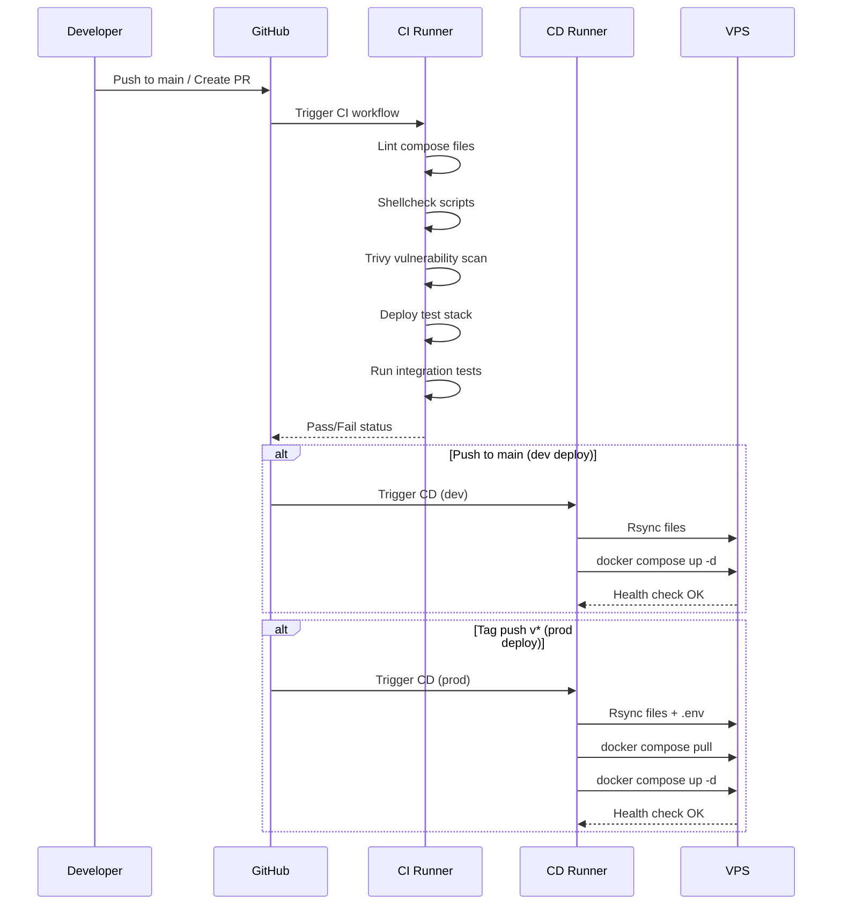
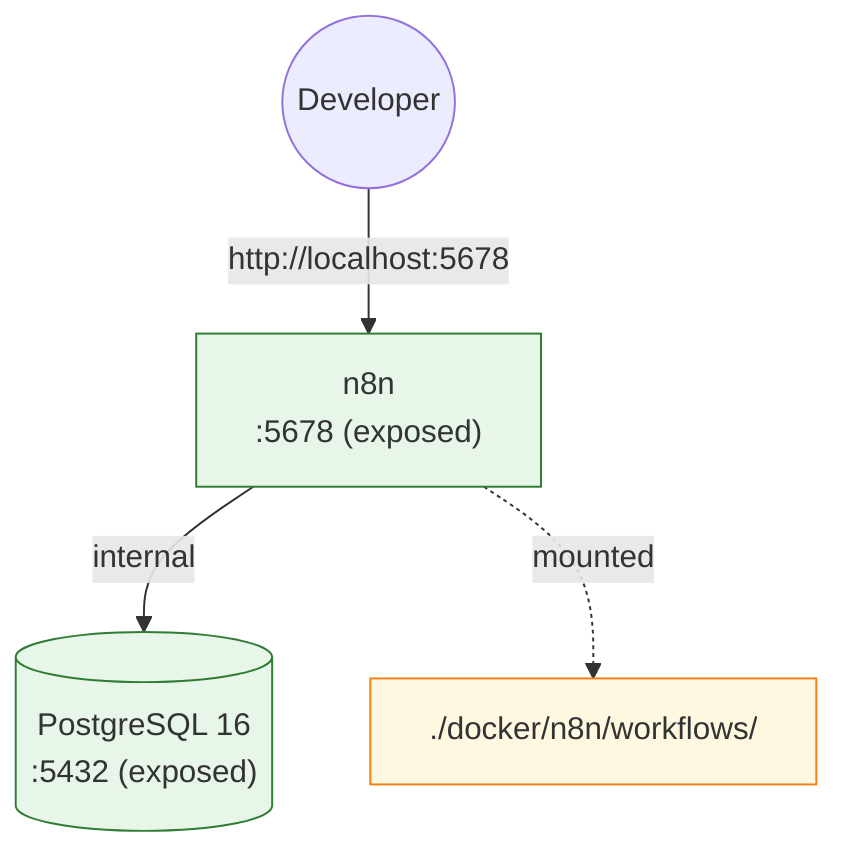
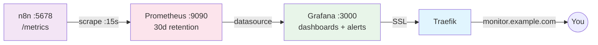
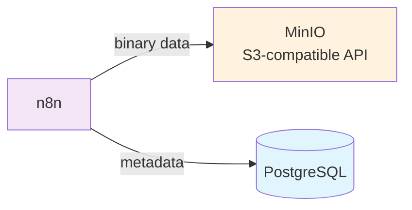
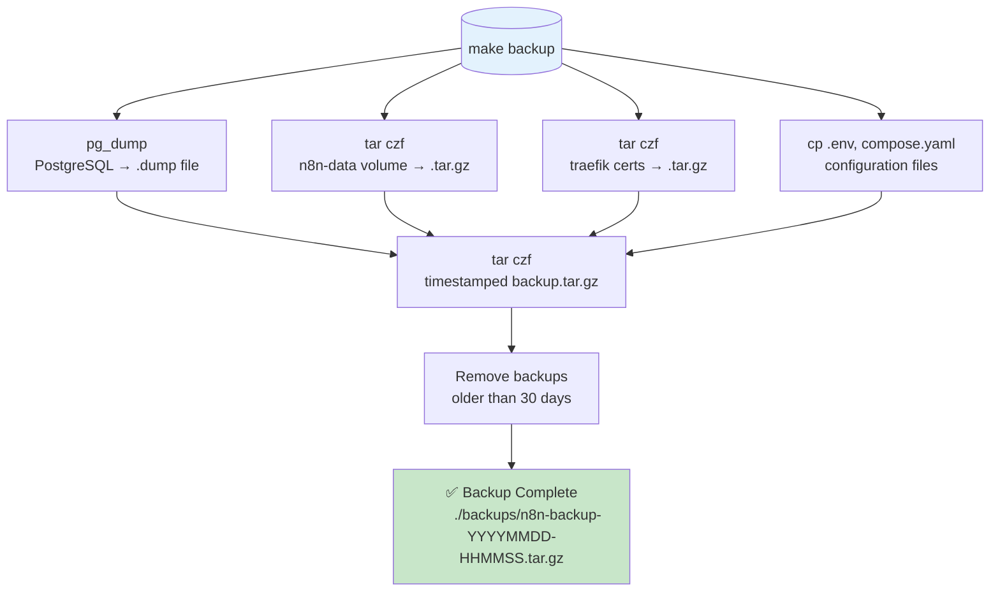

# n8n Docker Production Stack

Production-grade, self-hosted n8n with PostgreSQL + Traefik SSL, dev/prod environments, CI/CD, and automated security updates.

## Architecture



### Deployment Flow



### CI/CD Pipeline



## Prerequisites

- **Docker** 24+ and **Docker Compose** v2 plugin
- **Domain name** with DNS A record pointing to your server
- **Ports 80/443** open (Traefik handles SSL termination)
- **Server**: 2 vCPU, 4GB RAM minimum; 4 vCPU, 8GB RAM recommended

## Quick Start

```bash
# 1. Clone
git clone https://github.com/vanchasrujankumar/n8n-docker-prod-stack.git
cd n8n-docker-prod-stack

# 2. Production setup (interactive - generates secrets, creates .env)
make setup

# 3. Edit .env with your domain and SSL email
nano .env

# 4. Deploy
make prod

# 5. Check it's running
make health
```

## Step-by-Step Setup Guide

### Step 1: DNS Configuration

Before deploying, configure DNS for your domain:

| Record Type | Name | Value | Target |
|-------------|------|-------|--------|
| A | `n8n` | `<your-server-ip>` | n8n workflow UI |
| A | `traefik` | `<your-server-ip>` | Traefik dashboard |
| A | `monitor` | `<your-server-ip>` | Grafana dashboards |
| A | `prometheus` | `<your-server-ip>` | Prometheus UI |
| A | `minio` | `<your-server-ip>` | MinIO S3 API |
| A | `minio-console` | `<your-server-ip>` | MinIO admin console |

This enables:
| URL | Service |
|-----|---------|
| `https://n8n.example.com` | n8n workflow UI |
| `https://traefik.example.com` | Traefik dashboard |
| `https://monitor.example.com` | Grafana dashboards |
| `https://prometheus.example.com` | Prometheus query UI |
| `https://minio.example.com` | MinIO S3-compatible API |
| `https://minio-console.example.com` | MinIO admin console |

**Verify DNS propagation:**
```bash
dig +short n8n.example.com
# Should return your server IP
```

### Step 2: Server Preparation

```bash
# SSH into your server
ssh user@your-server-ip

# Install Docker (Ubuntu/Debian)
curl -fsSL https://get.docker.com | sh
sudo usermod -aG docker $USER
# Log out and back in for group changes to take effect

# Verify
docker --version && docker compose version

# Clone the repo
git clone https://github.com/vanchasrujankumar/n8n-docker-prod-stack.git
cd n8n-docker-prod-stack
```

### Step 3: Run Setup Script

```bash
make setup
```

This interactive script will:
- Verify Docker and Docker Compose are installed
- Create the external `n8n-web` Docker network
- Create required directories
- Set correct permissions (UID/GID 1000 for n8n)
- Generate secure random secrets:
  - `N8N_ENCRYPTION_KEY` (openssl rand -hex 32)
  - `N8N_USER_MANAGEMENT_JWT_SECRET` (openssl rand -hex 32)
  - `DB_PASSWORD` (openssl rand -base64 24)
- Create `.env` from `.env.example` with generated values
- Optionally prompt for Traefik dashboard credentials (requires htpasswd)

### Step 4: Configure .env

Edit `.env` and fill in the required values:

```bash
nano .env
```

**Required fields:**
```ini
DOMAIN_NAME=example.com
N8N_HOST=n8n.example.com
SSL_EMAIL=admin@example.com
```

**Traefik dashboard credentials:**
```bash
# Generate htpasswd hash
htpasswd -nb admin your_secure_password | sed -e 's/\$/\$\$/g'
# Copy the output to TRAEFIK_AUTH_PASS_HASH in .env
```

### Step 5: Deploy Production

```bash
make prod
```

This command:
1. Pulls the latest Docker images
2. Creates containers in detached mode
3. Waits for all services to become healthy (up to 150s)
4. Prints access URLs

**Verify deployment:**
```bash
make ps          # Container status
make health      # Full health check
make logs        # Live logs
```

### Step 6: Create n8n Admin User

After deployment, navigate to `https://n8n.example.com` in your browser.

**First-time setup (owner account):**

```bash
# Option A: Via browser (recommended)
# Visit https://n8n.example.com and follow the setup wizard

# Option B: Via CLI (headless setup)
docker exec -it n8n n8n user:create \
  --email admin@example.com \
  --password "YourSecurePassword123!" \
  --firstName Admin \
  --lastName User
```

### Step 7: Configure Traefik Dashboard Auth

Visit `https://traefik.example.com` and log in with the credentials you set in `.env`.

---

## Development Environment

### Setup Dev

```bash
# From the project root
cp .env.dev.example .env.dev
make dev
```

Access n8n at `http://localhost:5678`.

### Dev Environment Architecture



### Dev vs Prod Differences

| Feature | Production | Development |
|---------|-----------|-------------|
| Access | `https://n8n.example.com` | `http://localhost:5678` |
| SSL | Let's Encrypt (auto) | None |
| Reverse Proxy | Traefik | Direct port |
| Execution Mode | Own process (isolated) | Main process (debug) |
| Data Pruning | 7 days retention | Disabled (keep all) |
| Log Level | info | debug |
| Database | Internal network only | Port 5432 exposed |
| Resource Limits | CPU/Memory capped | Unrestricted |

---

---

## Monitoring (Prometheus + Grafana)

The stack includes a full monitoring suite out of the box. n8n exposes Prometheus metrics at `/metrics` (enabled via `N8N_METRICS=true`).



### Access Dashboards

| URL | Credentials |
|-----|-------------|
| `https://monitor.example.com` | Set via `GRAFANA_ADMIN_USER` / `GRAFANA_ADMIN_PASSWORD` in `.env` |
| `https://prometheus.example.com` | No auth (internal) |

### Pre-configured Dashboards

The `n8n-overview` dashboard (auto-provisioned) includes:

| Panel | Description |
|-------|-------------|
| n8n Status | Up/down health indicator |
| PostgreSQL Status | Database connectivity |
| Execution Rate | Success/failed/running executions per second |
| Execution Duration | p50/p95/p99 latency histograms |
| Workflow Status | Table of workflows by state |
| Active Webhooks | Count of registered webhooks |
| PostgreSQL Connections | Active vs max database connections |
| MinIO Storage | Object count and bucket usage |

### Alert Rules

Pre-configured alerts in Prometheus:

| Alert | Threshold | Severity |
|-------|-----------|----------|
| n8nDown | 1m unreachable | Critical |
| HighExecutionFailures | >0.1/s over 5m | Warning |
| PostgresDown | 30s unreachable | Critical |
| PostgresHighConnections | >50 active | Warning |
| DiskSpaceLow | <10% free | Critical |

### Grafana Plugins

Pre-install plugins by setting in `.env`:
```ini
GRAFANA_PLUGINS=grafana-piechart-panel,grafana-worldmap-panel
```

---

## Email / SMTP

Required for user invitations, password resets, and workflow notification nodes.

### Configuration

Set these in `.env`:

```ini
N8N_EMAIL_MODE=smtp
N8N_SMTP_HOST=smtp.sendgrid.net
N8N_SMTP_PORT=587
N8N_SMTP_USER=apikey
N8N_SMTP_PASS=your_sendgrid_api_key
N8N_EMAIL_FROM=n8n@example.com
```

**Providers:**

| Provider | SMTP Host | Port | Notes |
|----------|-----------|------|-------|
| SendGrid | `smtp.sendgrid.net` | 587 | Use API key as password |
| AWS SES | `email-smtp.region.amazonaws.com` | 587 | Requires SMTP credentials from IAM |
| Mailgun | `smtp.mailgun.org` | 587 | Use login credentials |
| Gmail | `smtp.gmail.com` | 587 | App password required |
| Mailjet | `in-v3.mailjet.com` | 587 | API key / secret key |
| Postmark | `smtp.postmarkapp.com` | 587 | Server API token |

### Verify Email Works

After deployment, test from the n8n terminal:
```bash
docker exec -it n8n n8n email:test --email your@email.com
```

---

## Object Storage (MinIO)

n8n stores binary data (files, images, CSVs) locally by default. For production with multiple workers or high throughput, offload to S3-compatible storage.



### Enable S3 Binary Storage

1. **Deploy the stack** (MinIO starts automatically)
2. **Create a bucket** via MinIO console (`https://minio-console.example.com`):
   - Log in with `MINIO_ROOT_USER` / `MINIO_ROOT_PASSWORD`
   - Create bucket named `n8n-binaries` (or your `N8N_BINARY_DATA_STORAGE_S3_BUCKET_NAME`)
3. **Switch n8n to S3 mode** by editing `.env`:

```ini
N8N_DEFAULT_BINARY_DATA_MODE=s3
N8N_BINARY_DATA_STORAGE_S3_BUCKET_NAME=n8n-binaries
N8N_BINARY_DATA_STORAGE_S3_ACCESS_KEY=${MINIO_ROOT_USER}
N8N_BINARY_DATA_STORAGE_S3_SECRET_ACCESS_KEY=${MINIO_ROOT_PASSWORD}
N8N_BINARY_DATA_STORAGE_S3_FORCE_PATH_STYLE=true
N8N_BINARY_DATA_STORAGE_S3_HOST=minio.example.com
N8N_BINARY_DATA_STORAGE_S3_PROTOCOL=https
```

4. **Recreate n8n**: `docker compose up -d n8n`

### MinIO Console

Access at `https://minio-console.example.com` for bucket management, access key creation, and usage metrics.

---

## User Management

### Create Additional Users

```bash
docker exec -it n8n n8n user:create \
  --email user@example.com \
  --password "SecurePassword123!" \
  --firstName Jane \
  --lastName Doe \
  --role member
```

### List Users

```bash
docker exec -it n8n n8n user:list
```

### Reset User Password

```bash
docker exec -it n8n n8n user:reset-password --email user@example.com
```

### Enable/Disable User

```bash
docker exec -it n8n n8n user:disable --email user@example.com
docker exec -it n8n n8n user:enable --email user@example.com
```

---

## Common Operations

### View Logs

```bash
make logs            # All containers
make logs-n8n        # n8n only
make logs-db         # PostgreSQL only
docker compose logs -f --tail=100 n8n   # Last 100 lines with follow
```

### Update n8n Version

```bash
# Pull latest image and recreate containers
make update

# Or pin a specific version in compose.yaml:
#   image: docker.n8n.io/n8nio/n8n:1.72.0
```

### Backup Flow



### Backup

```bash
# Default backup (saved to ./backups/)
make backup

# Custom backup location
make backup-to path=/mnt/nas/backups

# Scheduled backup (add to crontab -e):
# 0 2 * * * /opt/n8n-docker-prod-stack/scripts/backup.sh

# Verify backup integrity:
./scripts/verify-backup.sh

# Scheduled verification (add to crontab -e):
# 0 3 * * 0 /opt/n8n-docker-prod-stack/scripts/verify-backup.sh
```

# Custom backup location
make backup-to path=/mnt/nas/backups

# Manual backup
docker exec n8n-postgres pg_dump -U n8n -d n8n_production > backup.sql
```

### Restore from Backup

```bash
# 1. Extract backup
tar xzf backups/n8n-backup-20260101-120000.tar.gz

# 2. Restore PostgreSQL
docker exec -i n8n-postgres pg_restore -U n8n -d n8n_production --clean < n8n_db.dump

# 3. Restore n8n data
docker exec -i n8n tar xzf - -C /home/node/.n8n/ < n8n-data.tar.gz

# 4. Restart n8n
docker compose restart n8n
```

### Stop & Start

```bash
make stop          # Stop production
make restart       # Restart all services
make down          # Stop and remove volumes (data loss!)
make clean         # Full cleanup including unused Docker resources
```

---

## CI/CD Pipeline

### CI (`.github/workflows/ci.yml`)

Triggered on push/PR to `main`:
1. **Lint** - Validates compose YAML, shell scripts, env completeness
2. **Security** - Trivy vulnerability scan + Gitleaks secret detection
3. **Test** - Deploys stack, runs health checks, verifies API + DB

### CD (`.github/workflows/cd.yml`)

| Trigger | Environment | Description |
|---------|-------------|-------------|
| Push to `main` | dev | Auto-deploys to dev server |
| Tag `v*.*.*` | prod | Auto-deploys to production |
| `workflow_dispatch` | dev/prod | Manual deployment with confirmation |

**Required GitHub Secrets:**
```
SSH_PRIVATE_KEY      # Deploy server SSH key
SSH_HOST             # Server hostname/IP
SSH_USER             # SSH user
N8N_HOST             # Production domain
SSL_EMAIL            # Let's Encrypt email
DB_PASSWORD          # Database password
N8N_ENCRYPTION_KEY   # Encryption key (openssl rand -hex 32)
N8N_USER_MANAGEMENT_JWT_SECRET  # JWT secret
TRAEFIK_AUTH_USER    # Dashboard username
TRAEFIK_AUTH_PASS_HASH  # Dashboard password hash
DEPLOY_PATH          # Server path (default: /opt/n8n-docker-prod-stack)
```

---

## Automated Updates

### Renovate (`.github/renovate.json`)

- **Schedule**: Weekly (Monday 9 AM UTC)
- **Docker images**: Automatically checked for updates
- **n8n**: PR created for review (never auto-merged)
- **PostgreSQL/Traefik patches**: Auto-merged
- **Dashboard**: `https://github.com/vanchasrujankumar/n8n-docker-prod-stack#renovate-dashboard`

### WhiteSource/Mend (`.whitesource`)

- Scans Docker base images for vulnerabilities
- Integrates with GitHub for PR checks
- Reports on the Security tab of the repository

### Local Security Audits

```bash
# Run Trivy scan (install trivy first)
brew install trivy   # macOS
make test-security

# Manual scan
trivy image docker.n8n.io/n8nio/n8n:latest
trivy image postgres:16-alpine
trivy image traefik:v3.1
```

---

## Production Hardening Checklist

- [ ] DNS A records configured and propagated (n8n, traefik, monitor, prometheus, minio, minio-console)
- [ ] Port 80 (redirect) and 443 open; all others closed (firewall / security group)
- [ ] `.env` file permissions set to 600 (`chmod 600 .env`)
- [ ] Strong passwords generated for **all** secrets (DB, n8n, Grafana, MinIO, Traefik)
- [ ] SMTP configured and tested (`n8n email:test`)
- [ ] Traefik dashboard credentials configured
- [ ] Grafana admin password set (not default)
- [ ] MinIO root password set (not default)
- [ ] n8n metrics enabled (`N8N_METRICS=true`) for monitoring
- [ ] Prometheus retention configured (default 30d, adjust for your disk)
- [ ] Binary storage reviewed — switch to MinIO/S3 for production scale
- [ ] SSH key-based authentication (no passwords)
- [ ] Regular backups scheduled (cron: `0 2 * * * /opt/.../scripts/backup.sh`)
- [ ] Backup verification scheduled (cron: `0 3 * * 0 /opt/.../scripts/verify-backup.sh`)
- [ ] Docker daemon configured with `live-restore: true` and log rotation
- [ ] fail2ban or crowdsec installed for brute-force protection
- [ ] Regular `docker system prune -f` in crontab to clean unused resources

### Recommended Docker Daemon Config (`/etc/docker/daemon.json`)

```json
{
  "log-driver": "json-file",
  "log-opts": {
    "max-size": "10m",
    "max-file": "3"
  },
  "live-restore": true,
  "storage-driver": "overlay2"
}
```

---

## Troubleshooting

### SSL Certificate Not Issued

```bash
# Check Traefik logs
docker compose logs traefik

# Common issues:
# - DNS A record not pointing to this server
# - Port 80 blocked by firewall
# - Let's Encrypt rate limit (5 certs/week/domain)
```

### n8n Won't Start

```bash
# Check logs
docker compose logs n8n

# Verify database connectivity
docker exec -it n8n-postgres pg_isready -U n8n

# Restart n8n
docker compose restart n8n
```

### High Memory Usage

```bash
# View resource usage
make stats

# Tune in .env:
EXECUTIONS_PROCESS_LIMIT=3    # Reduce concurrent executions
N8N_PAYLOAD_SIZE_MAX=8        # Reduce max payload to 8MB

# Apply: docker compose up -d
```

### Reset Everything

```bash
# Full reset (deletes ALL data)
make clean-all

# Start fresh
make setup && make prod
```

---

## License

MIT
